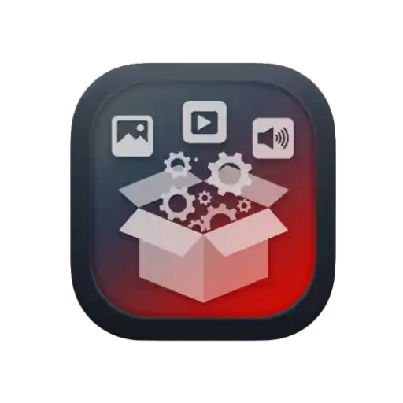

<div align="center">



# FFMBox - Self-Hosted Media Converter

</div>

FFMBox is a powerful, self-hosted web application for converting and compressing video, audio, and image files using FFmpeg. With its intuitive interface and extensive format support, FFMBox makes media conversion accessible to both beginners and advanced users.

## 🌟 Features

### Media Conversion

- **Video Conversion**: Convert between various video formats (MP4, WebM, etc.) with customizable quality settings
- **Audio Extraction & Conversion**: Extract audio from video files or convert between audio formats (MP3, AAC, OGG, etc.)
- **Image Processing**: Convert and optimize images with various presets
- **Batch Processing**: Convert multiple files simultaneously

### User Experience

- **Modern Web Interface**: Clean, responsive design with dark/light theme support
- **Drag & Drop**: Simple file upload with drag and drop functionality
- **Progress Tracking**: Real-time conversion progress with detailed status updates
- **Download Manager**: Organized download history with search and sort capabilities
- **Preset System**: Quick access to common conversion presets
- **Custom Commands**: Advanced users can input custom FFmpeg commands

### Technical Features

- **Self-hosted**: Run locally on your machine or private server
- **Cross-platform**: Works on Windows, macOS, and Linux
- **No File Size Limits**: Unlike cloud services, process files of any size
- **Privacy Focused**: All processing happens on your machine

## 🚀 Getting Started

### Prerequisites

- **Node.js** (v16 or higher) - [Download here](https://nodejs.org/)
- **FFmpeg** - Must be installed and available in your system PATH
  - Windows: [Download FFmpeg](https://ffmpeg.org/download.html#build-windows)
  - macOS: `brew install ffmpeg`
  - Linux: `sudo apt-get install ffmpeg` (Debian/Ubuntu)

### Installation

1. Clone the repository:

   ```bash
   git clone https://github.com/yourusername/FFMBox.git
   cd FFMBox
   ```

2. Install dependencies:

   ```bash
   npm install
   ```

3. Start the application:

   ```bash
   npm start
   ```

4. Open your browser and navigate to:

   ```text
   http://localhost:3000
   ```

## 🛠️ Usage

1. **Upload Files**: Drag and drop files or click to browse
2. **Select Media Type**: Choose between Video, Audio, or Image
3. **Choose Preset**: Select from optimized presets or use custom FFmpeg commands
4. **Convert**: Start the conversion process
5. **Download**: Get your converted files directly in the browser

### Supported Formats

#### Video

- Input: MP4, WebM, AVI, MOV, MKV, FLV, and more
- Output: MP4 (H.264, H.265), WebM (VP9), GIF

#### Audio

- Input: MP3, WAV, AAC, OGG, FLAC, and more
- Output: MP3, AAC, OGG Vorbis

#### Images

- Input: JPG, PNG, GIF, WebP, and more
- Output: JPG, PNG, WebP

## ⚙️ Configuration

### Environment Variables

Create a `.env` file in the root directory to customize the application:

```env
PORT=3000
MAX_FILE_SIZE=1073741824  # 1GB in bytes
TEMP_UPLOAD_DIR=./temp_uploads
TEMP_OUTPUT_DIR=./temp_outputs
```

### Custom Presets

You can modify or add presets in `src/config/presets.js` to include your frequently used conversion settings.

## 📦 Deployment

### PM2 (Production)

```bash
npm install -g pm2
pm2 start src/server.js --name "ffmbox"
```

## 🤝 Contributing

Contributions are welcome! Please read our [contributing guidelines](CONTRIBUTING.md) before submitting pull requests.

## 📄 License

This project is licensed under the MIT License - see the [LICENSE](LICENSE) file for details.

## 🙏 Acknowledgments

- Built with [FFmpeg](https://ffmpeg.org/)
- Powered by [Node.js](https://nodejs.org/) and [Express](https://expressjs.com/)
- UI built with vanilla JavaScript and modern CSS

---

💡 **Tip**: For best performance, ensure FFmpeg is compiled with hardware acceleration support for your system.
