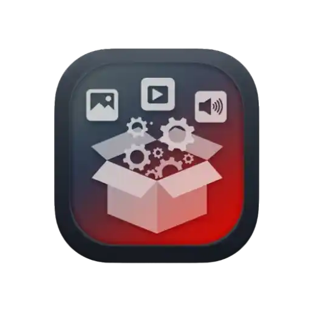

<div align="center">
  
  
  # <span style="display:inline-block;vertical-align:middle;">FFMBox</span>
  
  <h3>The Ultimate FFmpeg Media Converter & Compressor</h3>
</div>

---

## 🚀 Overview

**FFMBox** is a modern, Dockerized, self-sufficient web app for powerful media conversion, compression, and processing. Built with Node.js, React, Vite, and TypeScript, it leverages the full power of FFmpeg through a beautiful, intuitive interface. 

- **Convert, compress, and optimize** videos, audio, and images
- **Advanced watermarking** (image, text, scrolling/anti-piracy)
- **Custom FFmpeg command support**
- **Real-time progress** via WebSockets
- **Runs anywhere** (Docker, Linux, Windows, Mac)

---

## ✨ Features

### 🎥 Video
- MP4 (H.264, H.265/HEVC, ProRes, Fast, Mobile, 4K, MOV, MKV, WebM VP8/VP9)
- GIF (optimized, palette)
- Mute, trim, resize, extract frames, thumbnail collage

### 🎵 Audio
- MP3, AAC, FLAC, WAV, OGG, Opus
- Audio extraction from video

### 🖼️ Image
- JPEG, PNG, WebP, AVIF, TIFF, BMP
- Lossless, low-quality, optimized GIF/PNG/JPEG

### 🛠️ Utility
- **Watermark**: Image, text, or scrolling/looping text (anti-piracy)
- **Thumbnail Collage**: 9 frames in a square grid
- **Custom FFmpeg**: Run any FFmpeg command securely

### 💧 Watermarking (Advanced)
- **Type**: Image, Text, Scrolling Text
- **Position**: Top-left, top-right, bottom-left, bottom-right, center, custom (X/Y)
- **Margin**: Set distance from edge
- **Scale/Size**: % of video, or fixed size
- **Opacity**: 0–100%
- **Rotation**: Any angle
- **Timing**: Start/end time, fade in/out
- **Tiling**: Repeat watermark
- **Text Options**: Font, size, color, shadow, outline
- **Scrolling Text**: Speed, vertical position, loop/repeat interval
- **Font Selection**: Choose from bundled fonts (add your own in `/client/public/fonts/`)

### 🖥️ Tech Stack
- **Frontend**: React, Vite, TypeScript, TailwindCSS
- **Backend**: Node.js, Express, fluent-ffmpeg, WebSockets
- **Containerized**: Docker & Docker Compose

---

## 🏁 Quick Start

### 1. Clone & Configure
```bash
git clone https://github.com/yourusername/ffmbox.git
cd ffmbox
cp .env.example .env
# Edit .env as needed
```

### 2. Add Fonts (Optional)
Place `.ttf` font files in `client/public/fonts/` for use in text watermarks.

### 3. Build & Run (Docker Compose)
```bash
docker-compose up --build
```

### 4. Open in Browser
Visit: [http://localhost:6900](http://localhost:6900)

---

## 📝 Usage

1. **Upload** your media files (video, audio, image)
2. **Choose a preset** or use the advanced options
3. **Configure watermark/text** (if desired)
4. **Start conversion** and watch real-time progress
5. **Download** your optimized file!

---

## 🧩 Presets Overview

| Category | Presets |
|----------|---------|
| Video    | MP4, MP4-HQ, MP4-Fast, MP4-Mobile, HEVC, ProRes, MOV, MKV, 4K-HQ, WebM-VP8/VP9, GIF, Mute, Trim, Resize, Extract Frames, Thumbnail Collage |
| Audio    | MP3, AAC, FLAC, WAV, OGG, Opus, Audio Extract |
| Image    | JPEG, PNG, WebP, AVIF, TIFF, BMP, GIF-Optimized, PNG-Lossless, JPEG-Low |
| Utility  | Watermark (image/text/scrolling), Custom Command |

---

## 🔒 Security
- All custom FFmpeg commands are validated for safety
- File uploads are sanitized and limited by size/type
- Runs in a secure Docker container by default

---

## 💡 Tips
- For best results with text watermarks, add your own fonts to `/client/public/fonts/`
- Use the scrolling text watermark with loop/repeat for anti-piracy overlays
- Use the custom command area for advanced FFmpeg workflows

---

## 🤝 Contributing
Pull requests and suggestions are welcome! Please open an issue or PR.

---

## 📄 License
**GNU General Public License v3.0**

See the [LICENSE](LICENSE) file for details.

---

> <div align="center"><b>FFMBox</b> — The all-in-one, open-source media conversion toolbox powered by FFmpeg.</div>
